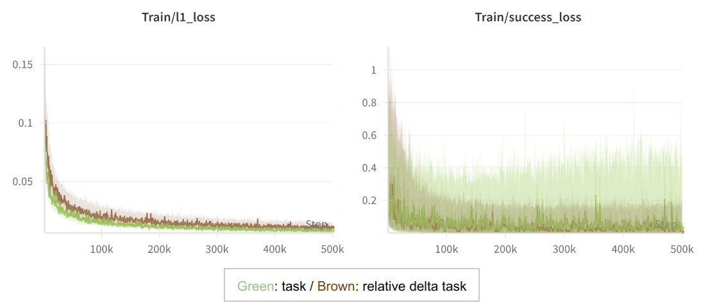

# Neuromeka Imitation Learning

This repository contains an implementation for training neural network controllers with imitation learning. The codebase was used to control either a single or dual [Indy7](https://en.neuromeka.com/indy) robots manufactured by Neuromeka. ([Demo video](https://youtu.be/xl4yk2qT7DA?si=70NDDoPU6yNK84tE))

### Installation
The required conda environment (name: `env_il`) can be created as follows. The implementation was tested with CUDA 12.1 on NVIDIA RTX 4090.
```
conda env create -f environment.yaml -n env_il
```

### Training configurations
The codebase supports below configurations.

(1) Algorithm
- ACT (i.e., Action Chunking Transformer) [[Paper](https://arxiv.org/abs/2304.13705)]

(2) Robot mode
- Single robot arm
- Single robot arm with gripper
- Dual robot arm
- Dual robot arm with gripper

(3) Control mode (i.e., output of neural network)
- Task space
- Relative delta task space [[Paper](https://arxiv.org/abs/2402.10329)]

Configurations can be controlled via *yaml* files listed below `config`. Create a new folder and custom configuration files similar to those in `config/example`.

### Usage
The collected data should be first located under `data` as follows.
```
|- data
|---TASK_NAME
|----- 0.h5
|----- 1.h5
|---- ...
```
Then, follow below **three** steps.

First, activate conda environment.
```
conda activate env_il
```
Second, preprocess data. The preprocessed data will be saved under `processed_data`.
```
python preprocess.py --task TASK_NAME
```
Third, train neural networks.
```
python imitate.py --config-path=config/CONFIG_DIRECTORY --config-name=CONFIG_FILE
```

### Usage examples
We provide a pipeline that tests the implementation with randomly generated data, helping individuals understand the process and required data format.

First, create and preprocess synthetic data. Four datasets (*test_single_robot*, *test_single_robot_gripper*, *test_dual_robot*, *test_dual_robot_gripper*) will be generated under `data` and `processed_data`.
```
bash make_fake_data.sh
```
Then, train neural networks with example configurations.
```
# Example 1: Single robot + Task space action
python imitate.py --config-path=config/example --config-name=single_robot_task.yaml 

# Example 2: Single robot + Relative delta task space action
python imitate.py --config-path=config/example --config-name=single_robot_relative_delta.yaml

# Example 3: Single robot with gripper + Task space action
python imitate.py --config-path=config/example --config-name=single_robot_gripper_task.yaml

# Example 4: Single robot with gripper + Relative delta task space action
python imitate.py --config-path=config/example --config-name=single_robot_gripper_relative_delta.yaml

# Example 5: Dual robot + Task space action
python imitate.py --config-path=config/example --config-name=dual_robot_task.yaml

# Example 6: Dual robot + Relative delta task space action
python imitate.py --config-path=config/example --config-name=dual_robot_relative_delta.yaml

# Example 7: Dual robot with gripper + Task space action
python imitate.py --config-path=config/example --config-name=dual_robot_gripper_task.yaml

# Example 8: Dual robot with gripper + Relative delta task space action
python imitate.py --config-path=config/example --config-name=dual_robot_gripper_relative_delta.yaml 
```

### Training plot examples
[Wandb](https://wandb.ai/site/) can be enabled in the configuration file to visualize training progress. Below is an example results for single robot arm task.



### Credits
The algorithm code is modified version from [LeRobot](https://github.com/huggingface/lerobot), which is licensed under the Apache-2.0 license.

### Authors
[Neuromeka AI team](https://ai.neuromeka.com/)