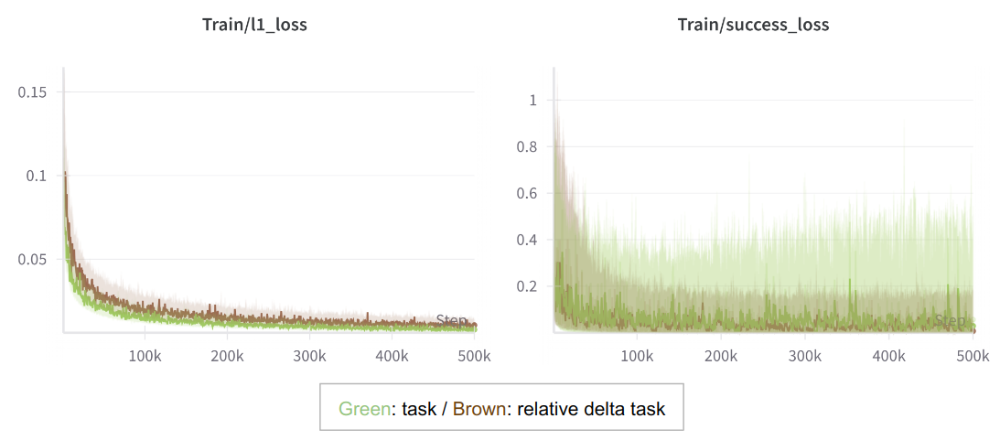

# Neuromeka Imitation Learning

This repository contains an implementation for training neural network controllers with imitation learning. The codebase was used to control either a single or dual [Indy7](https://en.neuromeka.com/indy) robots manufactured by Neuromeka. ([Demo video](https://youtu.be/xl4yk2qT7DA?si=70NDDoPU6yNK84tE)) The policy is based on [Action Chunking with Transformers (ACT)](https://arxiv.org/abs/2304.13705).

## Repository Structure

-   `train/`: Contains code for training imitation learning policies.
-   `deploy/`: Contains code for deploying trained policies on a robot.

## Installation

1.  Clone this repository:
    ```bash
    git clone <repository-url>
    cd <repository-directory>
    ```

2.  Create a conda environment using the provided `train/environment.yaml` file. The required conda environment (name: `env_il`) can be created as follows. The implementation was tested with CUDA 12.1 on NVIDIA RTX 4090.
    ```bash
    conda env create -f train/environment.yaml -n env_il
    ```

## Training

### Training configurations
The codebase supports below configurations.

(1) Algorithm
- ACT (i.e., Action Chunking Transformer) [[Paper](https://arxiv.org/abs/2304.13705)]

(2) Robot mode
- Single robot arm
- Single robot arm with gripper
- Dual robot arm
- Dual robot arm with gripper

(3) Control mode (i.e., output of neural network)
- Task space
- Relative delta task space [[Paper](https://arxiv.org/abs/2402.10329)]

Configurations can be controlled via *yaml* files listed below `train/config`. Create a new folder and custom configuration files similar to those in `train/config/example`.

### Usage
The collected data should be first located under `data` as follows.
```
|- data
|---TASK_NAME
|----- 0.h5
|----- 1.h5
|---- ...
```
Then, follow below **three** steps.

First, activate conda environment.
```
conda activate env_il
```
Second, preprocess data. The preprocessed data will be saved under `processed_data`.
```
python train/preprocess.py --task TASK_NAME
```
Third, train neural networks.
```
python train/imitate.py --config-path=train/config/CONFIG_DIRECTORY --config-name=CONFIG_FILE
```

### Usage examples
We provide a pipeline that tests the implementation with randomly generated data, helping individuals understand the process and required data format.

Before proceeding with the pipeline below, make sure that your SSD has at least 1GB of free memory.

First, create and preprocess synthetic data. Four datasets (*test_single_robot*, *test_single_robot_gripper*, *test_dual_robot*, *test_dual_robot_gripper*) will be generated under `data` and `processed_data`.
```
bash train/make_fake_data.sh
```
Then, train neural networks with example configurations.
```
# Example 1: Single robot + Task space action
python train/imitate.py --config-path=train/config/example --config-name=single_robot_task.yaml 

# Example 2: Single robot + Relative delta task space action
python train/imitate.py --config-path=train/config/example --config-name=single_robot_relative_delta.yaml

# Example 3: Single robot with gripper + Task space action
python train/imitate.py --config-path=train/config/example --config-name=single_robot_gripper_task.yaml

# Example 4: Single robot with gripper + Relative delta task space action
python train/imitate.py --config-path=train/config/example --config-name=single_robot_gripper_relative_delta.yaml

# Example 5: Dual robot + Task space action
python train/imitate.py --config-path=train/config/example --config-name=dual_robot_task.yaml

# Example 6: Dual robot + Relative delta task space action
python train/imitate.py --config-path=train/config/example --config-name=dual_robot_relative_delta.yaml

# Example 7: Dual robot with gripper + Task space action
python train/imitate.py --config-path=train/config/example --config-name=dual_robot_gripper_task.yaml

# Example 8: Dual robot with gripper + Relative delta task space action
python train/imitate.py --config-path=train/config/example --config-name=dual_robot_gripper_relative_delta.yaml 
```

### Training plot examples
[Wandb](https://wandb.ai/site/) can be enabled in the configuration file to visualize training progress. Below is an example results for single robot arm task.



## Deployment

The `deploy` directory contains the necessary code to run the trained policy on a real Neuromeka robot.

### 1. Copy Trained Weights

Copy the trained policy weights (`.pth` file) from the training output directory to `deploy/weights/<your_task_name>/`. You might need to create this directory.

### 2. Configure Deployment Settings

-   **Robot Configuration**: Update robot IP addresses and other parameters in `deploy/config/robot.py`.
-   **Model Configuration**: Check `deploy/config/model.py` for policy-related settings.

### 3. Run the Mimic Server

The `MimicServer` is a gRPC server that loads the policy and exposes methods to control the robot.

To start the server:
```bash
python deploy/MimicServer.py
```

You can also use the `deploy/RunMimicServer.ipynb` notebook for an interactive way to start and test the server.

### 4. Control the Robot

Once the server is running, you can use a gRPC client to send commands. The available RPCs are defined in `deploy/communication/impl/mimic.proto` and include:
-   `SetRobotAddress`
-   `GetSkillList`
-   `GetSkillHome`
-   `RunSkill`
-   `StopSkill`

## Credits
The algorithm code is modified version from [LeRobot](https://github.com/huggingface/lerobot), which is licensed under the Apache-2.0 license.

## Authors
[Neuromeka AI team](https://ai.neuromeka.com/)

## License

This project is licensed under the terms of the license agreement found in `train/LICENSE`.
