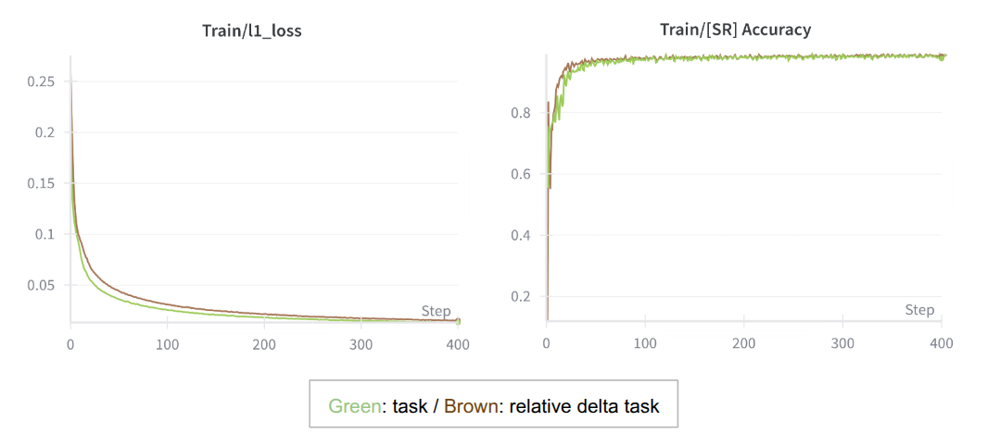

# Training
The `train` directory contains the necessary code to train policies with imitation learning.

## Training configurations
The codebase supports below configurations.

(1) Algorithm
- ACT (i.e., Action Chunking Transformer) [[Paper](https://arxiv.org/abs/2304.13705)]

(2) Robot mode
- Single robot arm
- Single robot arm with gripper
- Dual robot arm
- Dual robot arm with gripper

(3) Control mode (i.e., output of neural network)
- Task space
- Relative delta task space [[Paper](https://arxiv.org/abs/2402.10329)]

Configurations can be controlled via *yaml* files listed below `config`. Create a new folder and custom configuration files similar to those in `config/fake_data_example` and `config/real_data_example`.

## Usage
The collected data should be first located under `data` as follows.
```
|- data
|---TASK_NAME
|----- 0.h5
|----- 1.h5
|---- ...
```
Then, follow below **three** steps.

First, activate conda environment.
```
conda activate env_il
```
Second, preprocess data. The preprocessed data will be saved under `processed_data`.
```
python preprocess.py --task TASK_NAME
```
Third, train neural networks.
```
python imitate.py --config-path=config/CONFIG_DIRECTORY --config-name=CONFIG_FILE
```

## Usage examples
We provide a pipeline that tests the implementation with randomly generated data, helping individuals understand the process and required data format.

Before proceeding with the pipeline below, make sure that your SSD has at least 1GB of free memory.

First, create and preprocess synthetic data. Four datasets (*test_single_robot*, *test_single_robot_gripper*, *test_dual_robot*, *test_dual_robot_gripper*) will be generated under `data` and `processed_data`.
```
bash unit_test/make_fake_data.sh
```
Then, train neural networks with example configurations.
```
# Example 1: Single robot + Task space action
python imitate.py --config-path=config/fake_data_example --config-name=single_robot_task.yaml 

# Example 2: Single robot + Relative delta task space action
python imitate.py --config-path=config/fake_data_example --config-name=single_robot_relative_delta.yaml

# Example 3: Single robot with gripper + Task space action
python imitate.py --config-path=config/fake_data_example --config-name=single_robot_gripper_task.yaml

# Example 4: Single robot with gripper + Relative delta task space action
python imitate.py --config-path=config/fake_data_example --config-name=single_robot_gripper_relative_delta.yaml

# Example 5: Dual robot + Task space action
python imitate.py --config-path=config/fake_data_example --config-name=dual_robot_task.yaml

# Example 6: Dual robot + Relative delta task space action
python imitate.py --config-path=config/fake_data_example --config-name=dual_robot_relative_delta.yaml

# Example 7: Dual robot with gripper + Task space action
python imitate.py --config-path=config/fake_data_example --config-name=dual_robot_gripper_task.yaml

# Example 8: Dual robot with gripper + Relative delta task space action
python imitate.py --config-path=config/fake_data_example --config-name=dual_robot_gripper_relative_delta.yaml 
```

We also provide configuration files for training imitation policies with real-world data in `config/real_data_example`.

## Real data examples
Compatible data examples from the real world are given in `unit_test/example/data`. Data are collected using the teleoperation code provided in `deploy`.

## Training plot examples
[Wandb](https://wandb.ai/site/) can be enabled in the configuration file (`logging: True`) to visualize training progress. Below is an example results for single robot arm task.



